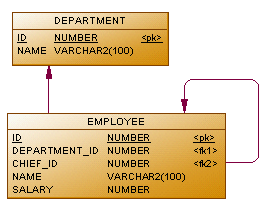

# Тестовое задание на Школу Инженера Digital Design (2023)

## Задание 1

Дана БД, имеющая  две таблицы: сотрудники и подразделение.
Необходимо написать 4 запроса.

Напишите запросы, которые выведут:

1. Сотрудника с максимальной заработной платой.
2. Вывести одно число: максимальную длину цепочки руководителей по таблице сотрудников (вычислить глубину дерева).
3. Отдел, с максимальной суммарной зарплатой сотрудников.
4. Сотрудника, чье имя начинается на «Р» и заканчивается на «н».

## Задание 2

Напишите консольное приложение на C#, которое на *вход* принимает большой **текстовый файл** (например «Война и мир», можно взять [отсюда](http://az.lib.ru/)). На *выходе* создает текстовый файл с перечислением всех **уникальных слов** встречающихся в тесте и количеством их употреблений, отсортированный в порядке убывания количества употреблений, например:

| Слова          | Посторений |
|----------------|------------|
| d'artifice     | 50         |
| говорит        | 48         |
| значительно    | 30         |
